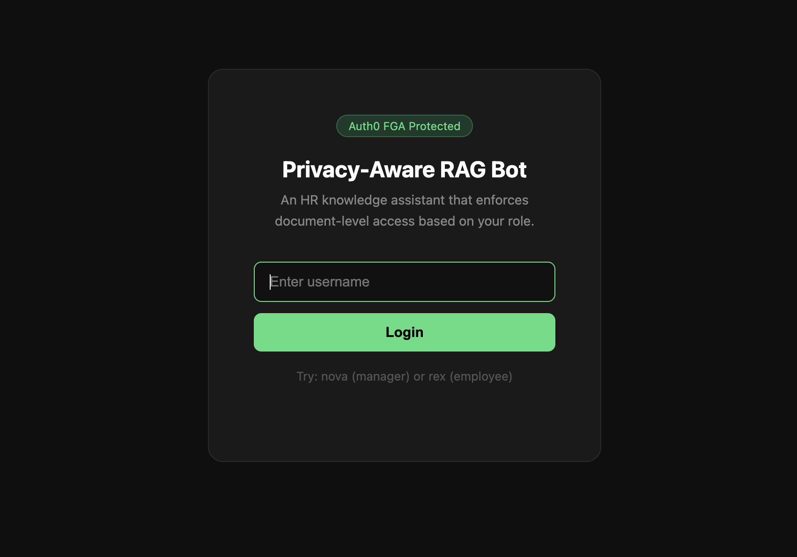
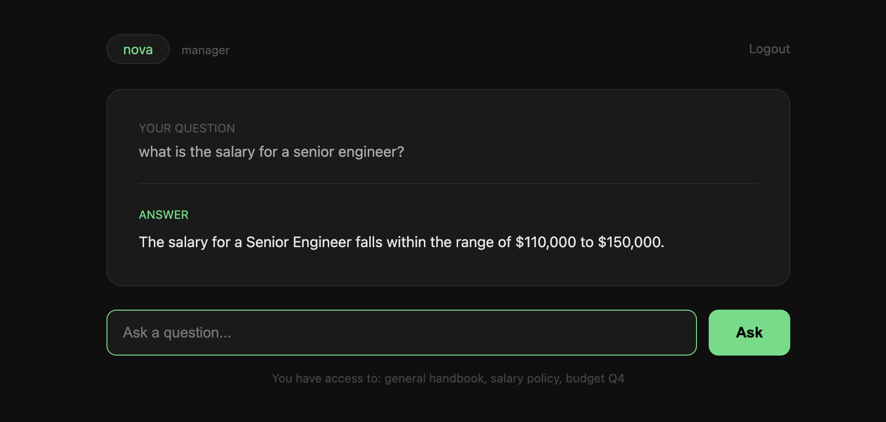
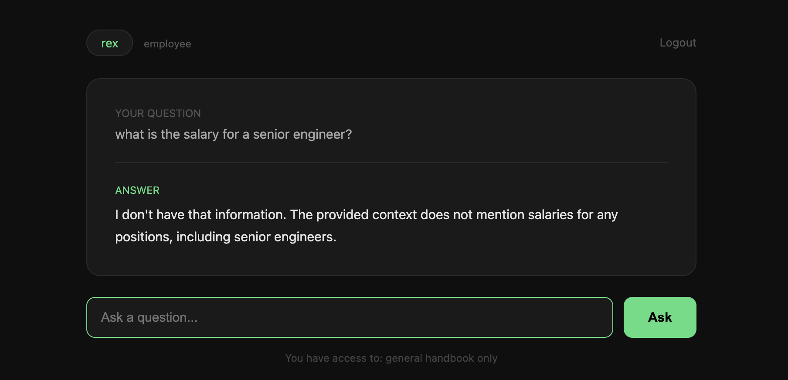

# Privacy-Aware RAG Bot

Most RAG bots have a problem — they retrieve documents based on what you ask, not based on who you are. That means a junior employee could potentially ask the right question and get back salary data or confidential budgets.

This project fixes that. Before the bot retrieves anything, it checks Auth0 FGA to see what documents the logged-in user is actually allowed to see. If you don't have access, the document doesn't exist as far as the bot is concerned.

---

## What is Auth0 FGA?

FGA stands for Fine-Grained Authorization. Instead of simple role checks like "is this user an admin?", FGA lets you define relationships between users and specific objects — like "user:nova can view document:salary_policy".

Think of it like Google Drive permissions but programmable. You define the rules, write the tuples, and then check them at runtime before doing anything sensitive.

---

## How the App Works

1. User logs in with their username
2. Before any document retrieval, the app asks FGA: "what documents can this user see?"
3. Only allowed documents are loaded into the FAISS vector store
4. The question is answered using only those documents
5. Sensitive documents are never even loaded for unauthorized users

```
User asks question
      ↓
FGA checks permissions
      ↓
Load only allowed documents
      ↓
FAISS finds relevant chunks
      ↓
Groq answers from those chunks
```

---

## Demo

### Login Page
<div align="center">
  
</div>

<br>

### Nova (Manager) — asks about salary, gets the answer
<div align="center">
  
</div>

<br>

### Rex (Employee) — asks the same question, gets blocked
<div align="center">
  
</div>

Same question. Different user. Different result. That's FGA working exactly as it should.

---

## Tech Stack

| Tool | What it does |
|------|-------------|
| Auth0 FGA | Checks document-level permissions before retrieval |
| Groq | LLM that generates answers (llama-3.3-70b-versatile) |
| FAISS | Local vector store for semantic search |
| HuggingFace Embeddings | Converts text into vectors (all-MiniLM-L6-v2) |
| Flask | Web framework |
| Python + uv | Backend and package management |

---

## Project Structure

```
privacy-aware-rag-bot/
├── app.py                      # main Flask app and RAG pipeline
├── setup_fga.py                # run once to set up FGA model and permissions
├── configs/
│   └── config.yaml             # app settings
├── documents/
│   ├── general_handbook.txt    # accessible by everyone
│   ├── salary_policy.txt       # managers only
│   └── budget_q4.txt           # managers only
├── templates/
│   ├── home.html               # login page
│   ├── chat.html               # chat interface
│   └── denied.html             # access denied page
├── assets/                     # screenshots
└── .env.example                # environment variable template
```

---

## Setup Guide

### 1. Clone and install

```bash
git clone https://github.com/mhd-faizzan/privacy-aware-rag-bot.git
cd privacy-aware-rag-bot
uv venv
source .venv/bin/activate
uv add flask python-dotenv groq openfga-sdk langchain langchain-community langchain-text-splitters faiss-cpu sentence-transformers pyyaml
```

### 2. Set up Auth0 FGA

1. Go to [dashboard.fga.dev](https://dashboard.fga.dev) and sign in
2. Create a new store — name it anything you like
3. Go to **Developer Mode** in the left sidebar
4. Create a new client and check all permissions
5. Copy your **Store ID**, **Client ID**, and **Client Secret**

### 3. Get a Groq API key

1. Go to [console.groq.com](https://console.groq.com)
2. Sign in and create a new API key
3. Copy it

### 4. Configure environment variables

```bash
cp .env.example .env
```

Fill in your `.env`:

```
FGA_API_URL=https://api.eu1.fga.dev
FGA_STORE_ID=your-store-id
FGA_CLIENT_ID=your-client-id
FGA_CLIENT_SECRET=your-client-secret
FGA_API_AUDIENCE=https://api.eu1.fga.dev/
FGA_TOKEN_ISSUER=auth.fga.dev
GROQ_API_KEY=your-groq-api-key
SECRET_KEY=any-random-string
```

### 5. Initialize FGA permissions

Run this once to create the authorization model and set up user permissions:

```bash
python setup_fga.py
```

You should see:
```
Authorization model created
Permissions set successfully
nova can access: salary_policy, budget_q4, general_handbook
rex can access: general_handbook only
```

### 6. Run the app

```bash
python app.py
```

Open `http://localhost:5001` and log in as `nova` or `rex`.

---

## Test it yourself

| Username | Role | Can access |
|----------|------|-----------|
| nova | Manager | Salary policy, Budget Q4, General handbook |
| rex | Employee | General handbook only |

Try asking both users: *"What is the salary for a senior engineer?"*

Nova gets the answer. Rex doesn't. That's the whole point.

---

## Built by

[Muhammad Faizan](https://github.com/mhd-faizzan) during MLH Global Hack Week 2026.